  

<h1 align="center">Ahmad Bukhari</h1>

<b>AI &amp; Automation Architect</b> — agentic systems that run real businesses, not just demos.

  <a href="https://ahmadbukhari.com">Portfolio</a> · <a href="https://www.linkedin.com/in/bukhariahmad">LinkedIn</a> · <a href="https://cursor.com/@ahmadbukhari">Cursor</a> · <a href="mailto:ahmadbukhari4245@gmail.com">Email</a>

  
  
  
  
  
  
  

  
  
  
  
  
  
  

  
  
  

---

### The journey

Not the traditional path — the honest one:

<b><code>no-code → low-code → vibe-coding → code</code></b>

I started with no-code tools and kept hitting their ceilings. Low-code bought me range. AI-assisted building made me fast. But the systems I wanted to ship demanded proper code — so I learned to write it. Now I use every layer deliberately: I know when a drag-and-drop workflow is enough, and when it's time to open the editor.

### What I build

- **AI agents** — Claude Agent SDK, Claude Code, MCP servers, custom skills
- **Automation pipelines** — n8n, Make, Lindy, event-driven workflows that document themselves
- **Integrations & tools** — REST APIs, webhooks, CRMs, chatbots, voice AI, internal dashboards

Everything I ship starts with the same question: *what breaks at 2 a.m., and how do we make sure it never does?*

### The numbers

  

  

### The snake eats my commits

  <picture>
    <source media="(prefers-color-scheme: dark)" srcset="https://raw.githubusercontent.com/syedahmad0786/syedahmad0786/output/github-snake-dark.svg"/>
    
  </picture>

---

<b>Open to client work</b> · ahmadbukhari4245@gmail.com

